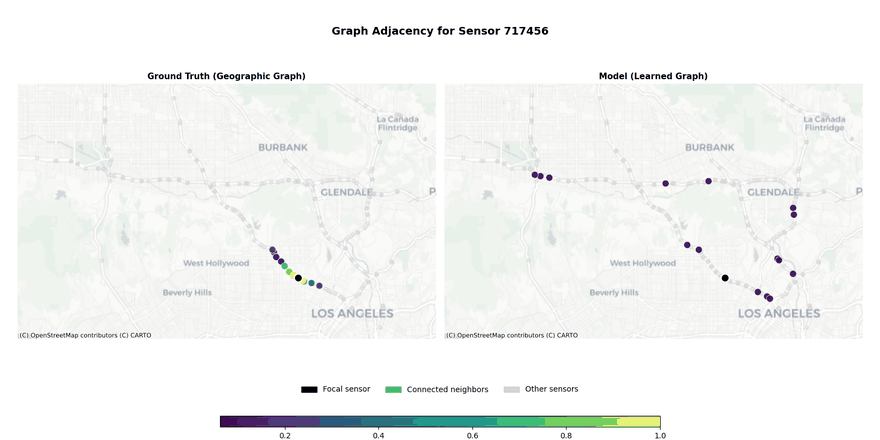
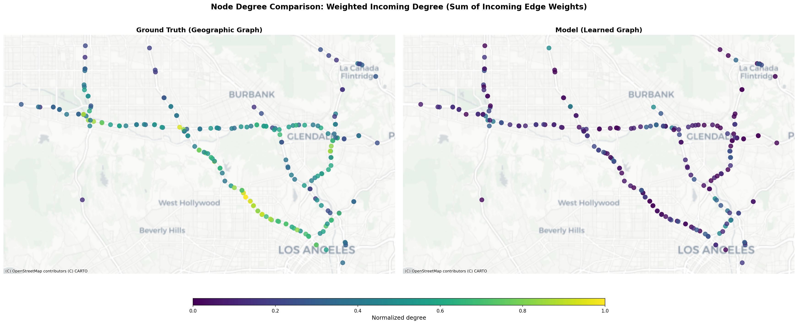

# Traffic Forecasting

Spatiotemporal traffic forecasting using STAdjFormer, our modular and reproducible variant of STGFormer - a hybrid Graph Transformer that combines graph convolution for local spatial patterns with linear-complexity attention for global dependencies.

This project was completed in partial fulfillment of [CS224W](https://web.stanford.edu/class/cs224w/index.html) course requirements.

## Prerequisites

- [uv](https://docs.astral.sh/uv/)

## Installation

```bash
uv sync --frozen
```

> On macOS/non-CUDA systems, use `--frozen` to avoid CUDA dependency resolution errors.

### Optional: Mamba Temporal Mode (CUDA only)

To enable Mamba temporal mode:

```bash
uv sync --extra cuda
```

**Requirements:**

- Linux + NVIDIA GPU + CUDA toolkit with nvcc compiler
- Not supported on macOS/CPU-only/AMD systems

All other models work on any hardware.

### Optional

The notebook(s) in this repo work as is when run via VSCode. To run them through Jupyter's interface directly first create the kernel by running:

```bash
uvx invoke install-kernel
```

then run it as usual and select the `traffic-forecasting` kernel or use:

```bash
uvx invoke notebook
```

to start Jupyter Notebook with the appropriate kernel pre-selected or:

```bash
uvx invoke lab
```

to start Jupyter Lab with the appropriate kernel pre-selected.

## Model Architecture

**STAdjFormer** is our modular and reproducible variant of STGFormer, a hybrid Graph Transformer combining:

- **Graph convolution branch**: K-hop neighborhood aggregation for local spatial structure
- **Transformer attention branch**: Linear complexity O(N+T) attention for global spatiotemporal patterns
- **Adaptive graph learning**: Learns graph structure from data (multiple modes: learned, geographic, hybrid, spectral)

**Key features:**

- Multiple temporal processing modes (Transformer, Mamba, TCN, depthwise convolution, MLP)
- Numerically stable graph propagation (Chebyshev polynomials)
- Type-safe configuration with comprehensive validation
- HuggingFace Hub integration for model sharing

## Visualizations






## Results

All models were trained for 100 epochs and the model state corresponding to the best MAE on validation set was returned: average over all 12 horizons for DCRNN and STGFormer and the 15min horizon for MTGNN and GWNET. The 100 epochs were in line with standard settings used by the original authors for all baseline models except for STGFormer which used 200 epochs for METR-LA and 300 epochs for PEMS-BAY, however we chose to also use 100 epochs in that case to make the metric comparison between models more meaningful.

### Baseline Comparisons

Comparison of our internal STGFormer implementation against external baselines: STGFormer, DCRNN, MTGNN, Graph WaveNet, and classical time-series models (AR, VAR).

See [Final Results with Baselines](docs/FINAL_RESULTS_WITH_BASELINES.md) for detailed performance metrics.

### Internal Experiments

Our experiments explored spatial (graph structure), temporal (processing modes), and training improvements. All internal experiments were run with 20 epochs for faster iteration. Key findings:

- **Final architecture:** Chebyshev+TCN+Xavier+DOW with ExcludeMissing normalization (K=16)
- **Best spatial:** Hybrid graph with Chebyshev propagation
- **Best temporal:** TCN outperforms Transformer, Mamba competitive
- **Ablation insights:** Graph propagation most critical (w/o: identity matrix, no message passing), ExcludeMissing essential for METR-LA

See comprehensive experimental results:

- [W&B Report](https://api.wandb.ai/links/cs224w-traffic-forecasting/suwzuvz7) - Interactive report with visualizations
- [Final Results with Baselines](docs/FINAL_RESULTS_WITH_BASELINES.md) - Final model vs all baselines
- [Full Experiment Results](docs/EXPERIMENT_RESULTS.md) - All experiments with detailed descriptions
- [Ablation Study](docs/ABLATION_RESULTS.md) - Component-wise impact analysis
- [Trimmed Results](docs/EXPERIMENT_RESULTS_TRIMMED.md) - Top 5 models per research direction

## Weights & Biases Integration

This project integrates with [Weights & Biases](https://wandb.ai/) for experiment tracking, metric visualization, and model performance monitoring. All training runs automatically log:

- Training and validation metrics (MAE, RMSE, MAPE)
- Model hyperparameters and configurations
- Runtime performance and hardware utilization
- Model architecture details

To enable W&B logging, ensure the `wandb` section in your config has `enabled` set to `true` (default for all distributed configs).

## Reproducibility

> **Note:** Use `uvx invoke` instead of `uv run invoke` on non-CUDA systems to avoid dependency resolution issues. The tasks will automatically delegate to `uv run` with proper flags.

To list all available tasks:

```bash
uvx invoke --list
```

For help on any specific task:

```bash
uvx invoke <task-name> --help
```

The datasets as well as all model weights are saved to public repositories and downloaded from there when computing metrics presented in this project.

**Note:** The [.env_public](./.env_public) file is used to control HuggingFace username for upload and download.

### Computing Baseline Results

To compute baseline metrics using pre-trained models from HuggingFace Hub:

```bash
uvx invoke compute-baselines
```

or to force re-inference from model weights saved in public HF repositories:

```bash
uvx invoke compute-baselines --force
```

### Training Baselines

To re-train baseline models from scratch:

```bash
uvx invoke train-baselines
```

If you wish to publish resulting model weights to your own HF repository add `--push-to-hub` flag and make sure the config has `enabled` set to `true` in `wandb` section (all configs distributed with this repo have it set that way already).

### Training Internal Models

To train our internal STGFormer variants and experimental models:

```bash
# Train the final model (100 epochs)
uvx invoke train-final

# Train all internal model variants
uvx invoke train-internal-models

# Train all experiment variants
uvx invoke train-all-experiments

# Train a specific experiment
uvx invoke train-experiment --name <experiment_name>
```

### Computing Internal Results

To compute metrics for internal model experiments:

```bash
# Compute metrics for all internal experiments
uvx invoke compute-results

# Generate experiment results report
uvx invoke compile-experiment-results

# Generate ablation study comparison
uvx invoke ablation-study
```

## Project Structure

```text
traffic-forecasting/
├── stgformer/          # Core STGFormer model implementation
├── utils/              # Training, inference, and visualization utilities
├── tests/              # Comprehensive test suite (8,600+ lines)
├── configs/            # Model and training configurations
├── scripts/            # Training and evaluation scripts
├── notebooks/          # Analysis and visualization notebooks
├── docs/               # Additional documentation and results
├── data/               # Datasets (downloaded automatically) [gitignored]
├── models/             # Saved model checkpoints [gitignored]
├── results/            # Computed metrics and predictions
├── outputs/            # Training outputs [gitignored]
├── wandb/              # W&B local logs [gitignored]
└── tasks.py            # Invoke task definitions for automation
```

**Note:** Folders marked as `[gitignored]` are not tracked in the repository and will be created automatically during training or data download.

## Development

This project was developed with assistance from [Claude Code](https://claude.com/claude-code), Anthropic's CLI tool for AI-assisted software development, which accelerated implementation, testing, documentation and refactoring efforts.
